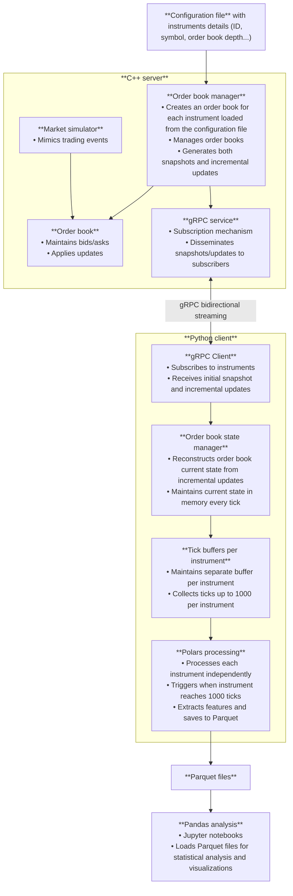
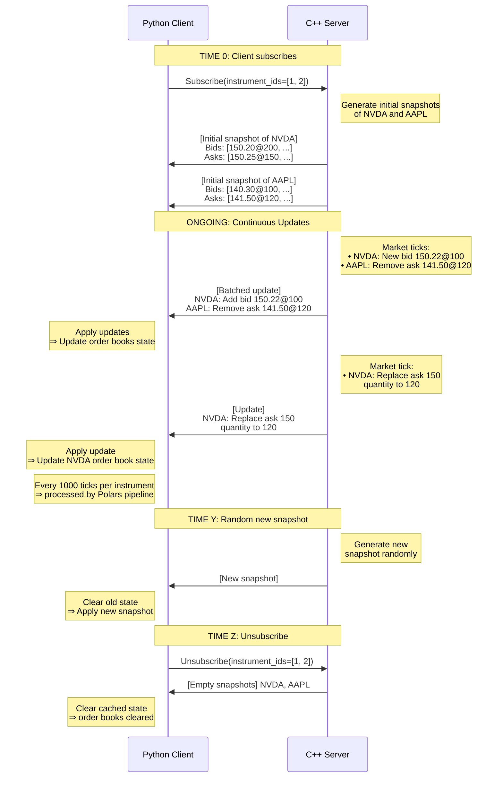

# Market Data Dissemination Simulator

This project is a market data dissemination simulator that consists of a C++ server and a Python client.

## Architecture diagram



## Sequence diagram


Given this configuration file:

```
{
    "port": 14000,
    "instruments": [
        {
            "id": 1,
            "symbol": "NVDA",
            "specifications": {
                "depth": 10
            }
        },
        {
            "id": 2,
            "symbol": "AAPL",
            "specifications": {
                "depth": 5
            }
        }
    ]
}
```




## Getting started


