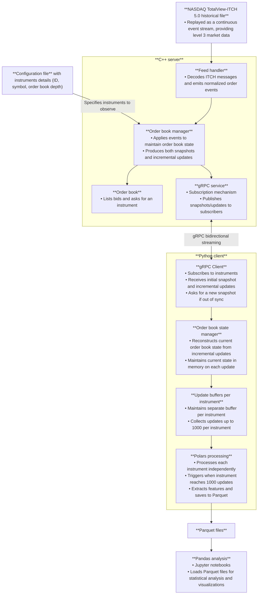
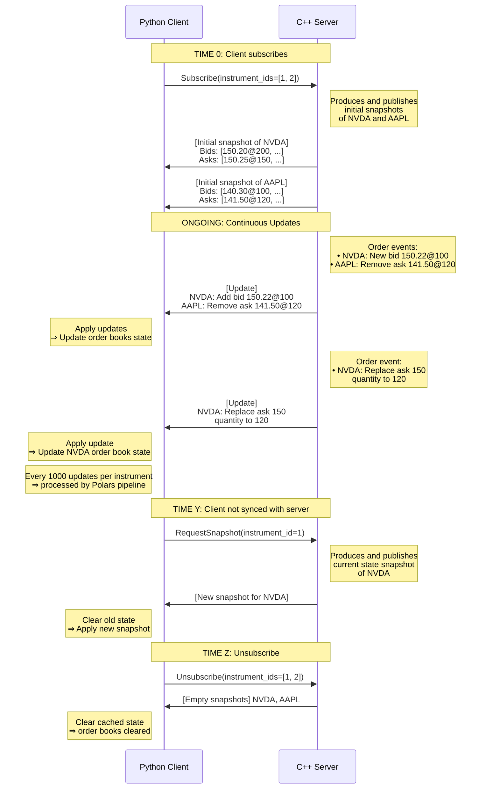

# Market Data Distribution Pipeline

This project is a market data distribution pipeline that consists of a C++ server and a Python client.

## Architecture diagram



## Sequence diagram


Given this configuration file:

```
{
  "port": 8080,
  "replay_speed": 1.0,
  "nasdaq_historical_file_path": "filepath",
  "instruments": [
    {
      "id": 1,
      "symbol": "NVDA",
      "specifications": {
        "depth": 10,
        "enabled": true
      }
    },
    {
      "id": 2,
      "symbol": "AAPL",
      "specifications": {
        "depth": 5,
        "enabled": true
      }
    }
  ]
}
```




## Stack used

- Build system: [CMake](https://cmake.org/), a cross-platform build system generator.
- Package manager: [Conan](https://conan.io/), a C/C++ dependency manager widely used in production environments.

### Librairies

- [cxxopts](https://github.com/jarro2783/cxxopts): a lightweight C++ command line option parser.


## Getting started

### Requirements

The project requires the following to run:

- [CMake](https://cmake.org/): if not installed, refer to the [installation guide](https://cmake.org/download/).
- [Conan](https://conan.io/): if not installed, refer to the [installtion guide](https://docs.conan.io/2/installation.html).

Run the following command:
```sh
conan profile detect --force
```

### Dataset

Download raw ITCH 5.0 data `01302020.NASDAQ_ITCH50.gz` from `https://emi.nasdaq.com/ITCH/Nasdaq%20ITCH/`.

The data format is defined by the document [Nasdaq TotalView-ITCH 5.0](https://www.nasdaqtrader.com/content/technicalsupport/specifications/dataproducts/NQTVITCHspecification.pdf).

### Installation

1. Clone the git repository.
```sh
git clone git@github.com:sephorah/market-data-simulator.git
cd market-data-simulator
```

2. Install dependencies.
```sh
./bin/setup.sh install
```

3. Build the project.
```sh
./bin/setup.sh build
```

4. Run the project.

Open a terminal and run the server.
```sh
./MarketDataSimulatorServer -f examples/simple-example.json
```